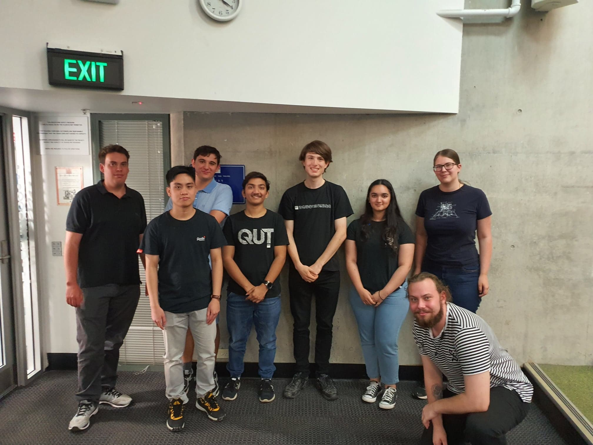

## QUT Robotics Club
The QUT Robotics Club is a student run organisation dedicated to promoting robotics within the QUT community and supporting QUT students’ future in Robotics.

## Pages
[Robots](https://qut-robotics-club.github.io/robots)
[Past Executives](https://qut-robotics-club.github.io/past-executives)

### Our Team

#### QUT Robotics Club Executives 2020-2021
+ President - Ryan Malone
+ Vice President - Cody Cripps
+ Treasurer - Harrison Giles
+ Secretary - Luigi Jaldon
+ General Executives - Haard Shar, Louis Von Richter, Smriti Bangera, Andrew Razjigaev, Lindsey Paul

### Social Media
Contact us on via the [Facebook Page](https://www.facebook.com/QUTRoboticsClub/) or [Facebook Group](https://www.facebook.com/groups/qutroboticsclub/), or email us at qutroboticsclub@gmail.com
